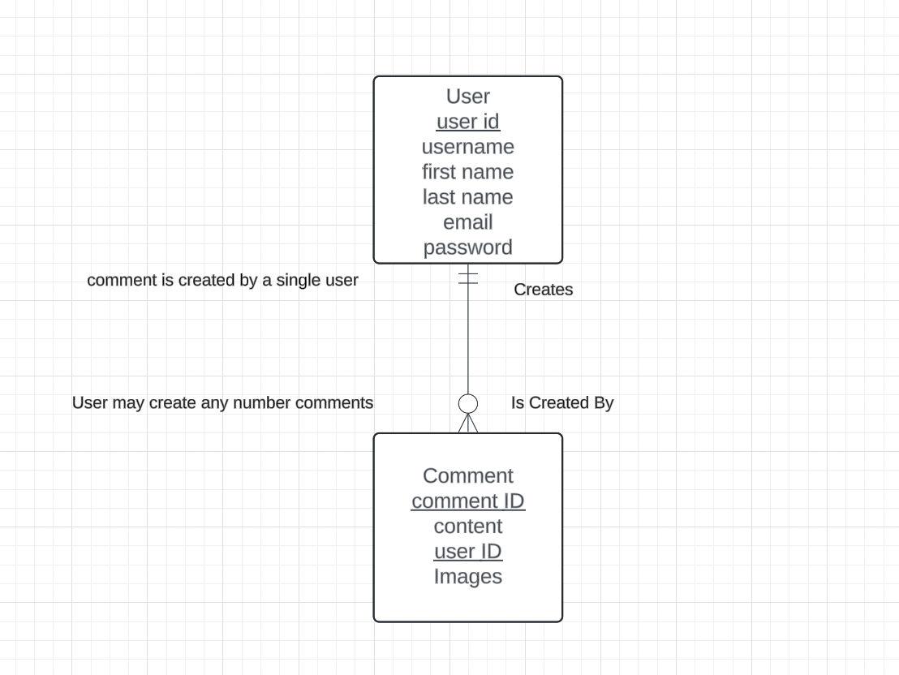
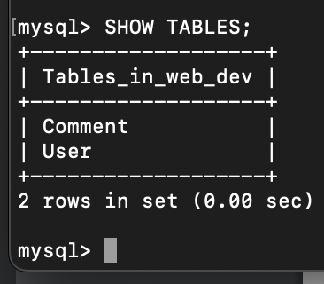

# Web.Dev

## Introduction 

Hello Dev is a project design to give users the opportunity to connect via a chatboard, it's implementation and design is based on a terminal that a user might be familiar with 

## How our Database is designed 

Simply put we only need our user and our comment and thats it!  

Below you will find our database implementation which is currently locally running

