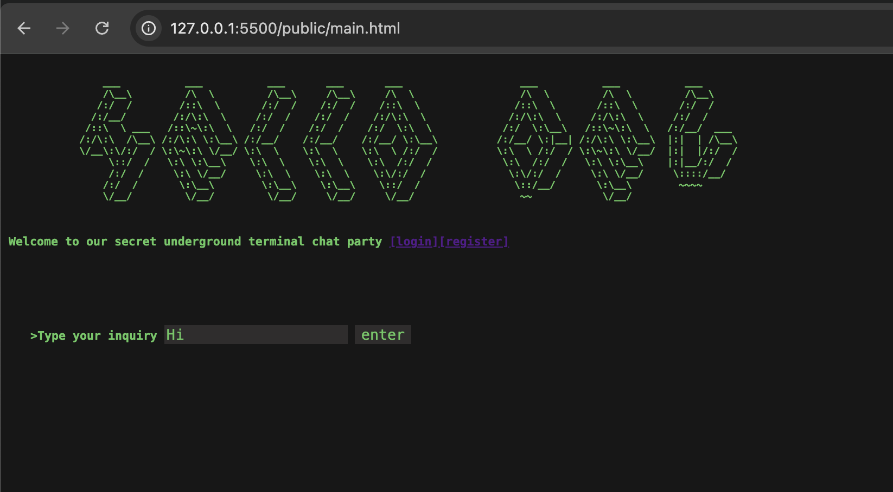
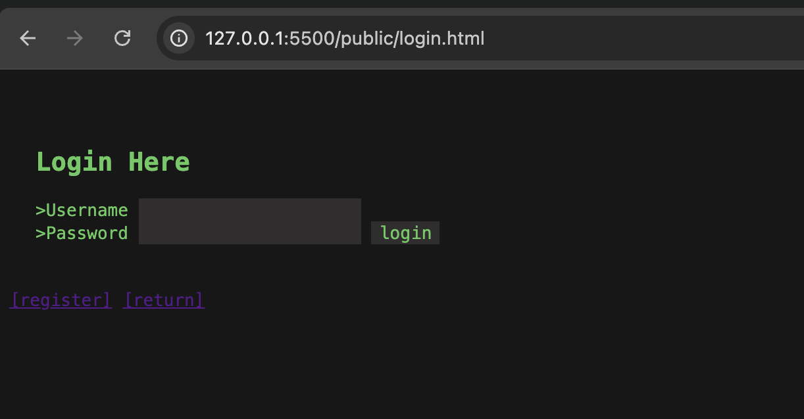
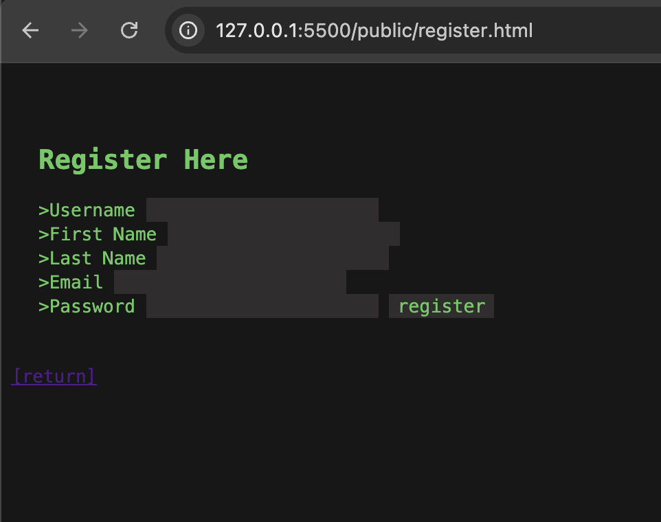
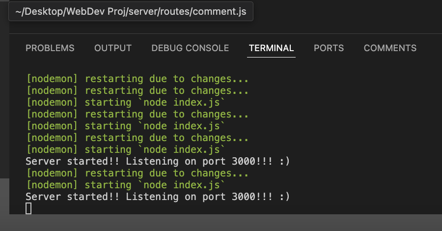

# Web.Dev

## Introduction 

Hello Dev is a project design to give users the opportunity to connect via a chatboard, it's implementation and design is based on a terminal that a user might be familiar with 

## The Website

The website gives the feel and vibe of an old school terminal page, with an added twist that you can communicate and chat with users globally.

### Logging In

Here's a snapshot of the login functionality:

### Registering

Registration is simple and streamlined:

## How our Database is designed 

Our database is minimalistic, focusing on the essentials. At its core, we only need to manage **users** and their **comments**, ensuring simplicity and efficiency.

Below you will find our database implementation which is currently locally running

To enhance functionality, we’ve integrated **nodemon** for live server hosting. This setup allows us to run the server locally while maintaining the flexibility to host remotely on platforms like AWS, Azure, or others if needed.

